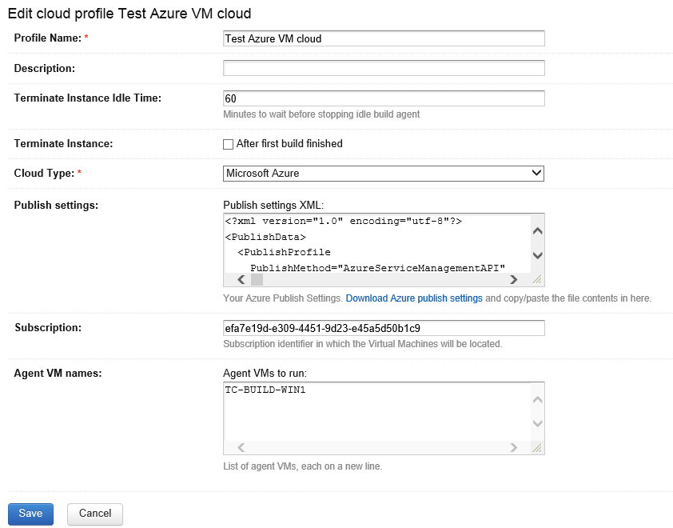

# Edit cloud profile

Creating and editing a cloud profile can be done from ***Administration | Agent Cloud***.

The following generic parameters can be specified:

* **Profile Name:** Name for the cloud profile.
* **Description:** Description for the cloud profile.
* **Terminate Instance Idle Time:** The number of minutes to wait before considering a virtual machine idle and stopping it.
* **Terminate Instance:** Should the instance be terminated after every build?
* **Cloud Type:** Select *Microsoft Azure* to make user of the Microsoft Azure cloud plugin for TeamCity.

Next, a series of parameters specific to the Microsoft Azure cloud plugin for TeamCity can be specified:

* **Publish settings:** Copy/paste the XML publish settings downloaded from the Microsoft Azure portal.
* **Subscription:** The Microsoft Azure subscription in which to run/stop instances.
* **Agent VM names:** List of agent VMs, each on a new line. For now, only existing VM names can be specified.

Here's an example:

